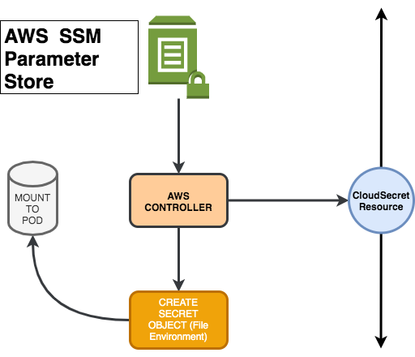

# CloudSecret Controller
</img>
```
AWS SSM Controller helps to us mirror the parameter store components to Kubernetes Secrets.You can easily get your secrets and create your kubernetes secrets as a file or environment variables.
```

## Usage

This is an example manifest file, you can get parameters starting with `prefix` and it create as a `file` or `env` there is two option.
Another required parameter is `secret_name`, that is the name of the kubernetes secrete name which will create.
`mount_file_name` is required parameter for the secrets which is needs to create via file.It creating secret file with the name `mount_file_name`.

```yaml
apiVersion: "woodprogrammer.io/v1"
kind: CloudSecret
metadata:
  name: staging-secrets-file
  namespace: default
spec:
  type: file
  prefix: "/dev/"
  secret_name: "staging-secrets-file"
  mount_file_name: "config.yaml"
  namespace: default
```

## Build && Installation
First Step : Create CRD shown below 
```
 $ kubectl apply -f crd/cloudsecret.yaml
```
Second Step: Deploy the controller 
```
 $ kubectl apply -f k8s/
```

If you are working with aws located clusters you should give access to nodes for `ssm:Verbs`.If you are using kiam, kube2iam or aws-iam-authenticator, you should  setup your policy access to namespace or pods.

### Project overview

</img>

## TODO

* Immutable Secrets
* AWS AccessKeys,SecretKeys to run controller on other cloud providers.

